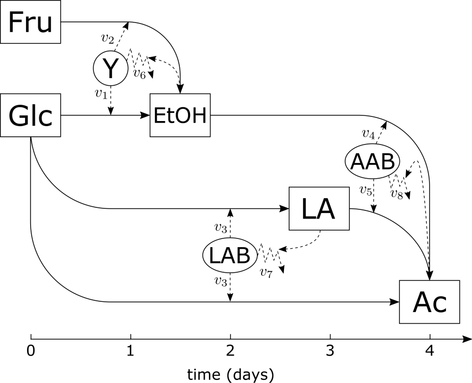
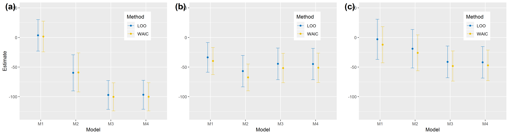
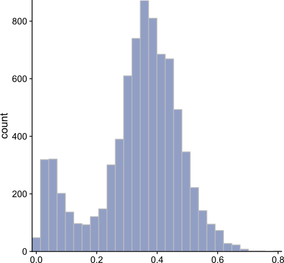
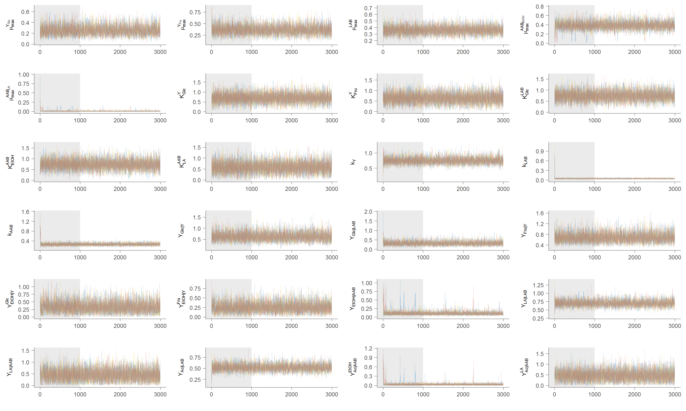
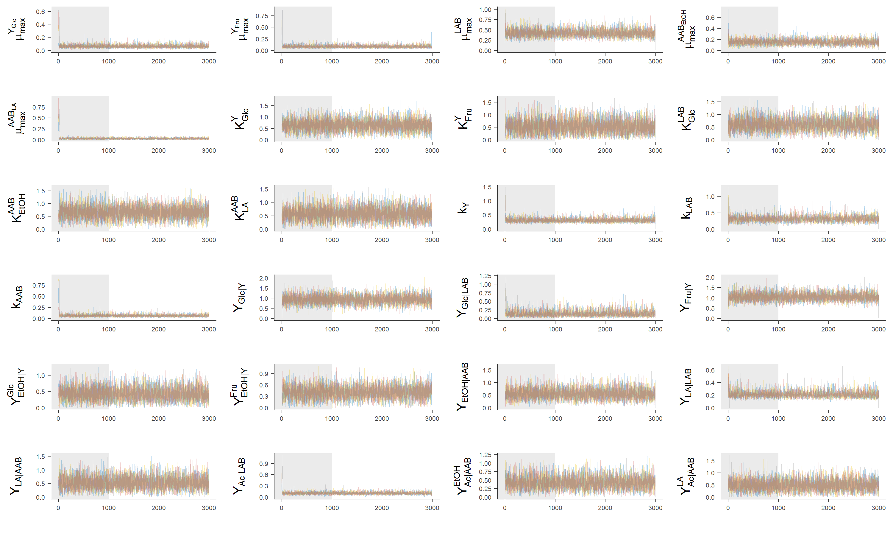
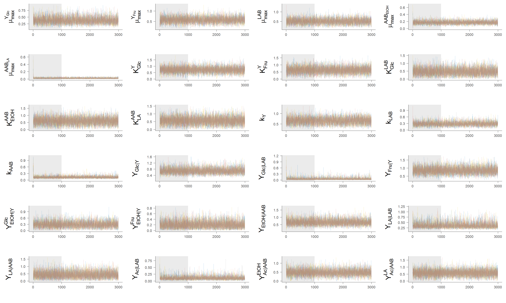
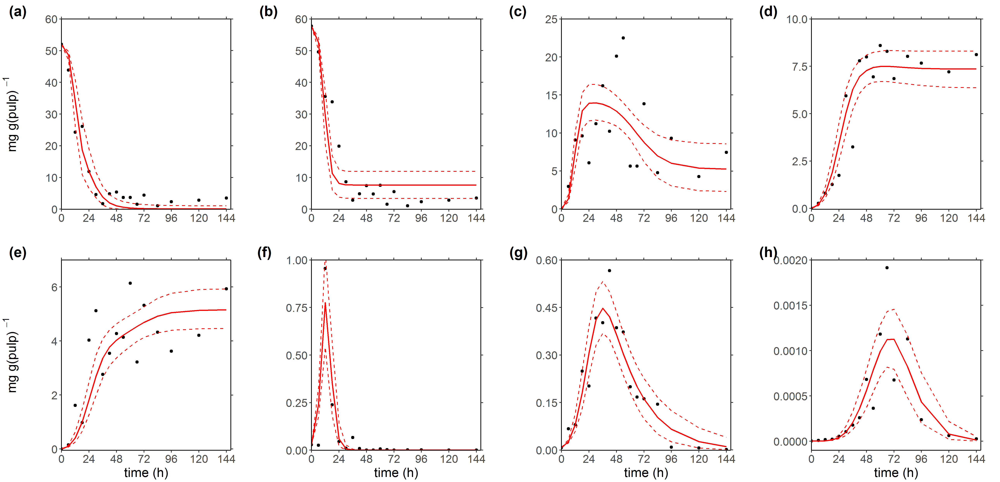
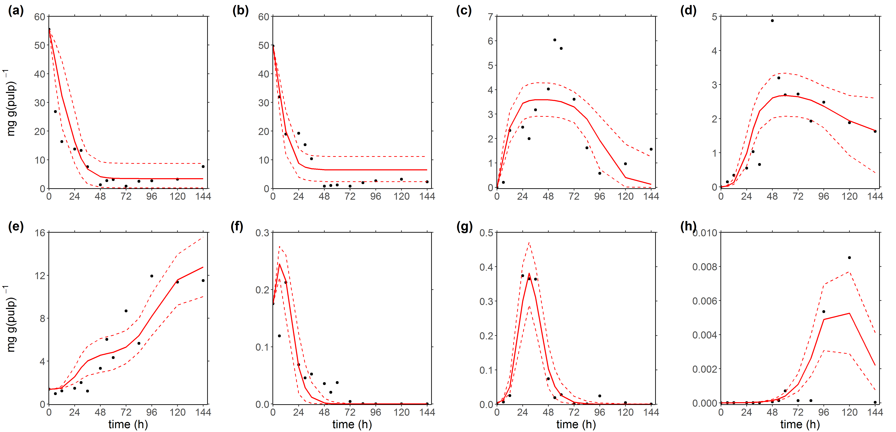
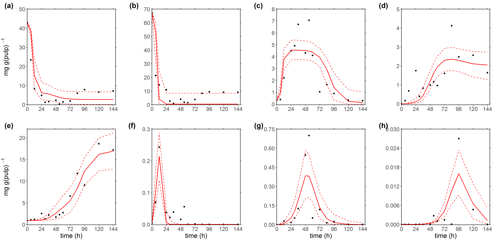
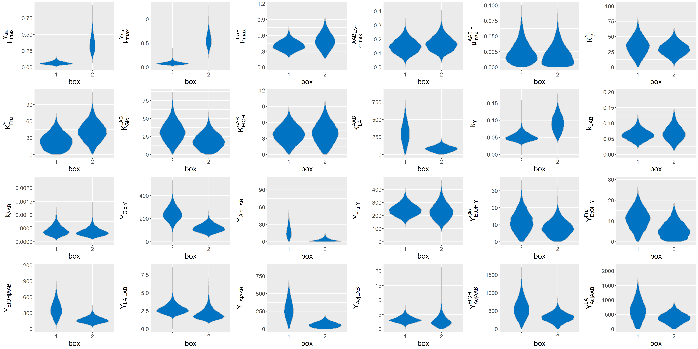

```{r setup, include=FALSE}
knitr::opts_chunk$set(echo = TRUE)
library(cowplot)
library(ggplot2)
library(rstan)
library(latex2exp)
library(ggsci)
library(dplyr)
library(tidyr)
library(knitr)
library(kableExtra)
```

## 1. Abstract
  
A key step in the production of chocolate is the fermentation of cocoa beans. This importance relies on its role in the development of chocolate's flavor and aroma. Unlike other food fermentation processes, this specific fermentation is well known because of its lack of control and multiple ways in which it is performed. Here, a quantitative model of cocoa bean fermentation is constructed on previously available data regarding microbiological and metabolites dynamics. The model is formulated as a system of coupled ordinary differential equations (ODEs) with two different types of state variables: (1) Metabolite concentrations of glucose (Glc), fructose (Fru), ethanol (EtOH), lactic acid (LA) and acetic acid (Ac), and (2) population sizes of yeast (Y), lactic acid bacteria (LAB) and acetic acid bacteria (AAB). In total, the model comprehends 25 unknown parameters that were estimated using the Markov chain Monte Carlo No-U-Turn sampler in *Rstan*. Thereafter, we demonstrate that the model can quantitatively describe existing fermentation series and that the estimated parameters can be used to extract and interpret differences in environmental conditions between two independent fermentation trials [1].

## 2. Biological background

The cocoa bean fermentation process occurs mostly in the pulp of raw cocoa beans right after opening of cocoa pods. It is called a spontaneous fermentation given  that there is little or not control on its conduction. Opposed to other fermentation processes, the microorganisms responsible for driving it come into first contact with the raw material (cocoa beans) by a pletora of ways, including their exposure with the farmers' hands, with tools used for the harvest and with the surface of fermenting devices. With respect to the latter, there are several methods that vary depending on the region where cocoa trees grow (i.e., heaps, wooden boxes and plastic containers) [2,3]. Despite these disparity of methodologies and inoculation means, it has been widely described in successful fermentations, the occurrence of three overlapping phasis. Each of these are governed by a different microbial group at a time in the same sequential order: (1) an early stage dominated by yeasts (Y), (2) a mid phase dominated by lactic acid bacteria (LAB) and (3) a final phase dominated by acetic acid bacteria (AAB).

<center>

```{r pressure, echo=FALSE, fig.cap="Figure 1. (a) Metabolite and (b) microbial dynamics during cocoa bean fermentation [1,2].", out.width = '66%'}

```

</center>

## 3. Material and methods

### 3.1. Experimental data

The experimental data in this study were reported by Papalexandratou *et al.*[3] and Camu *et al.* [4] from two spontaneous fermentations trials conducted in boxes in Brazil and one by the heap method in Ghana, respectively. Papalexandratou *et al.* trials were done by means of the *wooden boxes* fermentation method under slightly different conditions. In one instance, the trial known as 'box 1', was placed under a metal roof that provided protection from weather conditions. In the other, the trial known as 'box 2', was placed within a fermentary room.


### 3.2. Setting the baseline

By the qualitative description of the process, it is expected that the problem will become one of a coupled nature given the dependencies of all its dynamics on microbial growth. The basic interactions of the state variables can be summarized into the conversion of substrates (glucose (Glc) and fructose (Fru)) into ethanol (EtOH) by Y, Glc into lactic acid (LA) by LAB and EtOH into acetic acid (Ac) by AAB. These relationships can be defined by the use of equations that must take into account the substrate and product interactions. In the first case, several approximations have been developed, among them, the classical Monod and Contois models. For the later, we considered either the lack or precense of interactions between fermentation products and microbial growth by including linear and non-linear relationships upon the death rates responsible for the decrease on their population. Among these baseline decisions, four candidate models were assessed to fit the previously described data sets as shown in Table 1.

```{r echo=FALSE}

c1 <- c("M1","M2","M3","M4")
c2 <- c('no','yes','yes','yes')
c3 <- c('no','no','yes','yes')
c4 <- c('no','no','no','yes')

df = data.frame(cbind(c1,c2,c3,c4))
colnames(df) <- c('Model','Multiple substrate','Product toxicity','Population size effect for LA consumption')
kable(df,caption='Table 1. Summary of model`s iterations.')%>%kable_styling(full_width = F)
```

Where Model 1 considers as substrate a sum of Glc and Fru and the Population size effect for LA consumption refers to the use of the Contois equation for the consumption of LA by AAB.

For a more detailed description of the conceptualization of the model, check the [supplementary material](https://royalsocietypublishing.org/doi/suppl/10.1098/rsos.180964) accompanying the original manuscript 
<!-- Considering other processes such as the conversion of Glc into Ac by LAB and LA into Ac by AAB, one might end up with a diagram of the whole process as: -->

### 3.3 Mathematical formulation
Take for example model 4. Its mathematical formulation it is as follows.
 
<center>

```{r , echo=FALSE, fig.cap="Figure 2. Network diagram of the cocoa bean fermentation process. Growth and death rates are expressed as $v_i$ [1].", out.width = '40%'}

```

</center>

The growth and death rates ($v_i$) of microbial populations are driving the wires of the network. For the definition of the these rates, we used Monod or Contois equations for the former, and second- and third-order reaction terms for the latter.

Thus, growth rates are defined as:

$$\begin{align}
v_1 & = \frac{\mu_\text{max}^{\text{Y}_\text{Glc}}\,\left[\text{Glc}\right]}{\left[\text{Glc}\right]+K_{\text{Glc}}^{\text{Y}}}\,\left[\text{Y}\right]\\[4pt] 
v_2  &= \frac{\mu_\text{max}^{\text{Y}_\text{Fru}}\,\left[\text{Fru}\right]}{\left[\text{Fru}\right]+K_{\text{Fru}}^{\text{Y}}}\,\left[\text{Y}\right]\\[4pt]
v_3  &= \frac{\mu_\text{max}^\text{LAB}\,\left[\text{Glc}\right]}{\left[\text{Glc}\right]+K_{\text{Glc}}^{\text{LAB}}}\,\left[\text{LAB}\right]\\[4pt]
v_4  &= \frac{\mu_\text{max}^{\text{AAB}_\text{EtOH}}\,\left[\text{EtOH}\right]}{\left[\text{EtOH}\right]+K_{\text{EtOH}}^{\text{AAB}}}\,\left[\text{AAB}\right]\\[4pt]
v_5  &= \frac{\mu_\text{max}^{\text{AAB}_\text{LA}}\,\left[\text{LA}\right]}{\left[\text{LA}\right]+K_{\text{LA}}^{\text{AAB}}\,\left[\text{AAB}\right]}\left[\text{AAB}\right]
\end{align}$$

And the death rates as:

$$\begin{align}
v_6 &= k_{\text{Y}}\,\left[\text{Y}\right]\,\left[\text{EtOH}\right]\\
v_7 &= k_{\text{LAB}}\,\left[\text{LAB}\right]\,\left[\text{LA}\right]\\
v_8 &= k_{\text{AAB}}\,\left[\text{AAB}\right]\,\left[\text{Ac}\right]^2
\end{align}$$

So far, a sub-total of 13 unknown parameters are considered in these equations. Five maximum specific growth rates $\mu_\text{max}$ of the form $\mu_{\text{max}}^{i_n}$, where $i$ can be either Y, LAB and AAB, and $n$ refers whether $\mu$ corresponds to the maximum specific growth of Y on either Glc or Fru, or AAB on either EtOH or LA. Five substrate saturation constants for the growth of Y, LAB and AAB of the form $K_{m}^{j}$, where $j$ can be either Y or LAB and $m$ can be either Glc, Fru, EtOH and LA. Three constant mortality rates of the form $k_i$, where $i$ can be either Y, LAB or AAB.

By putting all these rates together, the addition of 11 more parameters is necessary for accounting the comsumption of substrates (i.e., Glc and Fru) and production of metabolites (i.e., EtOH, LA and Ac). Hence, by the formulation of the following system of ODEs, 11 *yield coefficients* of the form $Y_{\text{i}|{j}}^{k}$ where $i$ can be either Glc, Fru, EtOH, LA or Ac, $j$ can be either Y, LAB or AAB and $k$ can be either Glc, Fru, EtOH or LA.

$$\begin{align}
\frac{d\left[\text{Glc}\right]}{dt} &= -Y_{\text{Glc}|\text{Y}}\,v_1-Y_{\text{Glc}|\text{LAB}}\,v_3  \\[4pt] 
\frac{d\left[\text{Fru}\right]}{dt} &= -Y_{\text{Fru}|\text{Y}}\,v_2  \\[4pt] 
\frac{d\left[\text{EtOH}\right]}{dt} &= Y^{\text{Glc}}_{\text{EtOH}|\text{Y}}\,v_1 + Y^{\text{Fru}}_{\text{EtOH}|\text{Y}}\,v_2 - Y_{\text{EtOH}|\text{AAB}}\,v_4  \\[4pt] 
\frac{d\left[\text{LA}\right]}{dt} &= Y_{\text{LA}|\text{LAB}}\,v_3 - Y_{\text{LA}|\text{AAB}}\,v_5  \\[4pt]
\frac{d\left[\text{Ac}\right]}{dt} &= Y_{\text{Ac}|\text{LAB}}\,v_3 + Y^{\text{EtOH}}_{\text{Ac}|\text{AAB}}\,v_4 + Y^{\text{LA}}_{\text{Ac}|\text{AAB}}\,v_5 \label{2.5} \\[4pt] 
\frac{d\left[\text{Y}\right]}{dt} &= v_1+v_2-v_6  \\[2pt] 
\frac{d\left[\text{LAB}\right]}{dt} &= v_3-v_7   \\[2pt]
\frac{d\left[\text{AAB}\right]}{dt} &= v_4+v_5-v_8 
\end{align}$$

A complete interpretation of these parameters is the following:

```{r echo=FALSE}
mu1 = '$\\mu_\\text{max}^{\\text{Y}_\\text{Glc}}$'
mu2 = '$\\mu_\\text{max}^{\\text{Y}_\\text{Fru}}$'
mu3 = '$\\mu_\\text{max}^\\text{LAB}$'
mu4 = '$\\mu_\\text{max}^{\\text{AAB}_\\text{EtOH}}$'
mu5 = '$\\mu_\\text{max}^{\\text{AAB}_\\text{LA}}$'
ks1 = '$K_{\\text{Glc}}^{\\text{Y}}$'
ks2 = '$K_{\\text{Fru}}^{\\text{Y}}$'
ks3 = '$K_{\\text{Glc}}^{\\text{LAB}}$'
ks4 = '$K_{\\text{EtOH}}^{\\text{AAB}}$'
ks5 = '$K_{\\text{LA}}^{\\text{AAB}}$'
k1 = '$k_{\\text{Y}}$'
k2 = '$k_{\\text{LAB}}$'
k3 = '$k_{\\text{AAB}}$'
y1 = '$Y_{\\text{Glc}|\\text{Y}}$'
y2 = '$Y_{\\text{Glc}|\\text{LAB}}$'
y3 = '$Y_{\\text{Fru}|\\text{Y}}$'
y4 = '$Y^{\\text{Glc}}_{\\text{EtOH}|\\text{Y}}$'
y5 = '$Y^{\\text{Fru}}_{\\text{EtOH}|\\text{Y}}$'
y6 = '$Y_{\\text{EtOH}|\\text{AAB}}$'
y7 = '$Y_{\\text{LA}|\\text{LAB}}$'
y8 = '$Y_{\\text{LA}|\\text{AAB}}$'
y9 = '$Y_{\\text{Ac}|\\text{LAB}}$'
y10 = '$Y^{\\text{EtOH}}_{\\text{Ac}|\\text{AAB}}$'
y11 = '$Y^{\\text{LA}}_{\\text{Ac}|\\text{AAB}}$'

umu1 = '$\\text{mg Y  }\\text{h}^{-1}$'
umu2 = '$\\text{mg Y  }\\text{h}^{-1}$'
umu3 = '$\\text{mg LAB  }\\text{h}^{-1}$'
umu4 = '$\\text{mg AAB  }\\text{h}^{-1}$'
umu5 = '$\\text{mg AAB  }\\text{h}^{-1}$'
uks1 = '$\\text{mg Glc  g pulp}^{-1}$'
uks2 = '$\\text{mg Fru  g pulp}^{-1}$'
uks3 = '$\\text{mg Glc  g pulp}^{-1}$'
uks4 = '$\\text{mg EtOH  g pulp}^{-1}$'
uks5 = '$\\text{mg LA  g pulp}^{-1}$'
uk1 = '$\\text{mg Y  mg EtOH}^{-1}\\text{. h}^{-1}$'
uk2 = '$\\text{mg LAB  mg LA}^{-1}\\text{. h}^{-1}$'
uk3 = '$\\text{mg AAB  mg Ac}^{-2}\\text{. h}^{-1}$'
uy1 = '$\\text{mg Glc  mg Y}^{-1}$'
uy2 = '$\\text{mg Glc  mg LAB}^{-1}$'
uy3 = '$\\text{mg Fru  mg Y}^{-1}$'
uy4 = '$\\text{mg EtOH  mg Y}^{-1}$'
uy5 = '$\\text{mg EtOH  mg Y}^{-1}$'
uy6 = '$\\text{mg EtOH  mg AAB}^{-1}$'
uy7 = '$\\text{mg LA  mg LAB}^{-1}$'
uy8 = '$\\text{mg LA  mg AAB}^{-1}$'
uy9 = '$\\text{mg Ac  mg LAB}^{-1}$'
uy10 = '$\\text{mg Ac  mg AAB}^{-1}$'
uy11 = '$\\text{mg Ac  mg AAB}^{-1}$'

par = c(mu1,mu2,mu3,mu4,mu5,ks1,ks2,ks3,ks4,ks5,k1,k2,k3,y1,y2,y3,y4,y5,y6,y7,y8,y9,y10,y11)


upar = c(umu1,umu2,umu3,umu4,umu5,uks1,uks2,uks3,uks4,uks5,uk1,uk2,uk3,uy1,uy2,uy3,uy4,uy5,uy6,uy7,uy8,uy9,uy10,uy11)

inter <- c('Maximum specific growth rate of Y on Glc','Maximum specific growth rate of Y on Fru',
           'Maximum specific growth rate of LAB on Glc','Maximum specific growth rate of AAB on EtOH',
           'Maximum specific growth rate of AAB on LA','Substrate saturation constant of Y growth on Glc',
           'Substrate saturation constant of Y growth on Fru','Substrate saturation constant of LAB growth on Glc',
           'Substrate saturation constant of AAB growth on EtOH','Substrate saturation constant of AAB growth on LA',
           'Mortality rate constant of Y','Mortality rate constant of LAB','Mortality rate constant of AAB',
           'Y-to-Glc yield coefficient','LAB-to-Glc yield coefficient','Y-to-Fru yield coefficient',
           'Y-to-EtOH from Glc yield coefficient','Y-to-EtOH from Fru yield coefficient',
           'AAB-to-EtOH yield coefficient','LAB-to-LA yield coefficient','AAB-to-LA yield coefficient',
           'LAB-to-Ac yield coefficient','AAB-to-Ac from EtOH yield coefficient','AAB-to-Ac from LA yield coefficient'
           )

df = data.frame(cbind(par,upar,inter))
colnames(df) <- c('Parameter','Units','Interpretation')
kable(df,caption='Table 2. Interpretation of the parameters for model 4 [1].')%>%kable_styling(full_width = F)
```

### 3.4. Bayesian parameter estimation

The aforementioned parameters can be considered elements of a vector $\theta$ of the form $[\theta_1, \theta_2,\dots,\theta_k]$. By assuming that $\theta$ has originated the data $\mathcal{D}$, the parameter estimation problem can be solved by inferring the posterior probability of $\theta$ given $\mathcal{D}$, $P(\theta|\mathcal{D})$. This $P(\theta|\mathcal{D})$ can be expressed as the product over all series and each data point within time series as:

$$\begin{equation}
P\left(\theta\mid \mathcal{D}\right) \propto \prod_{i=1}^{T} \prod_{j=1}^{N} P\left(\mathcal{D}_{i,j}\mid\theta \right)\,P\left(\theta \right),
\end{equation}$$

where $\mathcal{D}_{i,j}$ is the data point from time series $i$ measured at time $j$.

By assuming that each observation $\mathcal{D}_{i,j}$ is drawn from a sampling distribution of the form:

$$\begin{equation}
\mathcal{D}_{i,j} \sim \mathcal{N}\left(f\left(x_{i,j},\theta\right),\sigma\right),
\end{equation}$$

Our $P(\theta|\mathcal{D})$ takes the following form:

$$\begin{equation}
P\left(\theta\mid \mathcal{D}\right) \propto \prod_{i=1}^{T} \prod_{j=1}^{N} \mathcal{N}\left(f\left(x_{i,j},\theta\right),\sigma\right)\,P\left(\theta \right),
\end{equation}$$

where an extra parameter $\sigma$ is needed for accounting the total standard deviation of the model.

#### 3.4.1. Dimensionality problem

Two problems arise when handling these data. On the one hand, the units in which microbial growth is measured constitutes the counting of Colony Forming Units (CFU). CFUs cannot be easily tossed in model with concentration measurements of metabolites (usually in milligrams per gram of pulp). For tackling this inconvenient, we make use of conversion factors from CFU to milligrams. These conversion factors were 15 picograms per CFU ($pg\,CFU^{-1}$), 1.25 $pg\,CFU^{-1}$ and 0.28 $pg\,CFU^{-1}$ for Y, LAB and AAB respectively (for a complete explanation of these conversion factors, see [1]). 

On the other hand, after the conversion of microbial counts into mass units, the time series corresponding to Y, LAB and AAB showed accute differences in orders of magnitude with respect to the units of the metabolites. Such differences, as it is well known, are likely to lead to computational problems in any optimization scheme. With the aim of overcoming such issues, a variable scaling was performed. This scaling consisted on dividing each time series by its corresponding maximum. In other words, all time series are constrained to account with maximum values equal to unity. 

From this point, the parameter estimation scheme is done over the scaled time series and once the posterior distribution of the parameters were obtained, these were subject to a re-scaling process to its real units through conversion factors derived mathematically from the ODE system (to see in further detail the re-scaling process, see [1]).


#### 3.4.2. Priors

By the scaling of the time series, we assumed that the differences of the parameters on their real scales that can be away in orders of magnitude, are then regularized. This means that priors for each single parameter can lie between 0 and 1. Thus, an independent normal distrubution with mean 0.5 and standard deviation equal to 0.3 can be impossed to each $k$ element of $\theta$. In the case of the standard deviation of the model $\sigma$, a heavy tailed distribution such a Cauchy with scale parameters of 0 and 1 will allow the sampling of extreme values that will cover possible outlying observations of the original data.

$$\begin{equation}
\begin{aligned}
  \theta_k &\sim \mathcal{N}(0.5,\,0.3),     && \theta_k>0 \\
  \sigma &\sim \mathcal{C}(0,\,1), && \sigma>0.
\end{aligned}
\end{equation}$$

### 3.5. Stan code

The aforementioned system of ODEs translated into Stan language is solved as an initial value problem, where the initial concentration of the 8 state variables are provided as they were reported in the original work of Papalexandratou *et al.* for boxes 1 and 2. In both cases, the ODEs were specified and solved by the mechanism *rk45*. The datasets were fitted by running 4 parallel Markov Chains of 3000 iterations each, 1000 of which were used as warm-up.

```
functions {
	real[] 	cbf(real t,
				real[] x,
				real[] theta,
				real[] y_r,
				int[] y_i) {
		real dxdt[8];
		
		dxdt[1] = - theta[1]*theta[12]*x[1]*x[6]/(theta[17]+x[1]) - theta[2]*theta[14]*x[1]*x[7]/(theta[19]+x[1]);
		dxdt[2] = - theta[3]*theta[13]*x[2]*x[6]/(theta[18]+x[2]);
		dxdt[3] = theta[4]*theta[12]*x[1]*x[6]/(theta[17]+x[1]) + theta[5]*theta[13]*x[2]*x[6]/(theta[18]+x[2]) - theta[6]*theta[15]*x[3]*x[8]/(theta[20]+x[3]);
		dxdt[4] = theta[7]*theta[14]*x[1]*x[7]/(theta[19]+x[1]) - theta[8]*theta[16]*x[4]*x[8]/(theta[21]*x[8]+x[4]);
		dxdt[5] = theta[9]*theta[14]*x[1]*x[7]/(theta[19]+x[1]) + theta[10]*theta[15]*x[3]*x[8]/(theta[20]+x[3]) +theta[11]*theta[16]*x[4]*x[8]/(theta[21]*x[8]+x[4]);
		dxdt[6] = theta[12]*x[1]*x[6]/(theta[17]+x[1]) + theta[13]*x[2]*x[6]/(theta[18]+x[2]) - theta[22]*x[6]*x[3];
		dxdt[7] = theta[14]*x[1]*x[7]/(theta[19]+x[1]) - theta[23]*x[7]*x[4];
		dxdt[8] = theta[15]*x[3]*x[8]/(theta[20]+x[3]) + theta[16]*x[4]*x[8]/(theta[21]*x[8]+x[4]) - theta[24]*x[8]*x[5]^2;
		
		return dxdt;
	}
}

data {
	int<lower=1> T;
	real<lower=0> x[T,8];
	real t0;
	real ts[T];
	real x0[8];
	real scl[8];

}

transformed data {

	real y_r[0];
	int y_i[0];
	real<lower=0> x0_1[8];
	real<lower=0> xn[T,8];
	for (t in 1:T)
		for (n in 1:8)
			xn[t,n]=x[t,n]/scl[n];
  
  for (n in 1:8)
    x0_1[n] = x0[n]/scl[n]; 
}
parameters {
	real <lower=0> sigma;
	real <lower=0> mu1;
	real <lower=0> mu2;
	real <lower=0> mu3;
	real <lower=0> mu4;
	real <lower=0> mu5;
	real <lower=0> ks1;
	real <lower=0> ks2;
	real <lower=0> ks3;
	real <lower=0> ks4;
	real <lower=0> ks5;
	real <lower=0> k1;
	real <lower=0> k2;
	real <lower=0> k3;
	real <lower=0> yc1;
	real <lower=0> yc2;
	real <lower=0> yc3;
	real <lower=0> yc4;
	real <lower=0> yc5;
	real <lower=0> yc6;
	real <lower=0> yc7;
	real <lower=0> yc8; 
	real <lower=0> yc9;
	real <lower=0> yc10;
	real <lower=0> yc11; 
}

transformed parameters {
	real x_hat[T,8];
	{
		real theta[24];
		theta[1] = yc1;
		theta[2] = yc2;
		theta[3] = yc3;
		theta[4] = yc4;
		theta[5] = yc5;
		theta[6] = yc6;
		theta[7] = yc7;
		theta[8] = yc8;
		theta[9] = yc9;
		theta[10] = yc10;
		theta[11] = yc11;
		theta[12] = mu1;
		theta[13] = mu2;
		theta[14] = mu3;
		theta[15] = mu4;
		theta[16] = mu5;
		theta[17] = ks1;
		theta[18] = ks2;
		theta[19] = ks3;
		theta[20] = ks4;
		theta[21] = ks5;
		theta[22] = k1;
		theta[23] = k2;
		theta[24] = k3;

		x_hat = integrate_ode_rk45(cbf, x0_1, t0, ts, theta, y_r, y_i,1.0E-6, 1.0E-6, 1.0E8);
	}
}
model{
	mu1~normal(0.5,0.3);
	mu2~normal(0.5,0.3);
	mu3~normal(0.5,0.3);
	mu4~normal(0.5,0.3);
	mu5~normal(0.5,0.3);
	ks1~normal(0.5,0.3);
	ks2~normal(0.5,0.3);
	ks3~normal(0.5,0.3);
	ks4~normal(0.5,0.3);
	ks5~normal(0.5,0.3);
	k1~normal(0.5,0.3);
	k2~normal(0.5,0.3);
	k3~normal(0.5,0.3);
	yc1~normal(0.5,0.3);
	yc2~normal(0.5,0.3);
	yc3~normal(0.5,0.3);
	yc4~normal(0.5,0.3);
	yc5~normal(0.5,0.3);
	yc6~normal(0.5,0.3);
	yc7~normal(0.5,0.3);
	yc8~normal(0.5,0.3);
	yc9~normal(0.5,0.3);
	yc10~normal(0.5,0.3);
	yc11~normal(0.5,0.3);
	sigma~cauchy(0,1);
	for (t in 1:T)
		xn[t]~normal(x_hat[t],sigma);
}

generated quantities{
	real log_lik[T,8];
	for (t in 1:T)
		for (n in 1:8)
			log_lik[t,n]=normal_lpdf(xn[t,n]|x_hat[t,n],sigma);
}

```

Both, Stan model and running scripts can be found in `model/`.

## 4. Results
The results for Camu *et al.*, box 1 and box 2 of Papalexandratou *et al.* can be found in `output/`. The R scripts for re-producing the following results can be found in `scripts/`.

### 4.1. Model selection
By conduction Leave-one-out cross-validation and widely applicable information criterion for the four models on all the data sets, the results suggest that models 3 and 4 have similar performances, at leas for the data corresponding to Camu and Box 2.

<center>

```{r , echo=FALSE, fig.cap="Figure 3. LOO and WAIC for the models (a) Camu, (b) box 1 and (c) box 2", out.width = '100%'}

```
</center>

However, we decided to take model 4 as the most plausible one given that the maximum growth rate of AAB on EtOH for model 3 showed a bimodal distribution.


<center>

```{r , echo=FALSE, fig.cap="Figure 4. Posterior distribution of the maximum especific growth rate of AAB on EtOH for model 3", out.width = '20%'}

```
</center>


### 4.2. Diagnostics for model 4

For Camu, box 1 and box 2, the traceplots did not show evidence of problems in the mixing of the chains.

<center>

```{r , echo=FALSE, fig.cap="Figure 5. Traceplots of the scaled 24 parameters of the model for Camu (excluding sigma).", out.width = '100%'}

```

```{r , echo=FALSE, fig.cap="Figure 6. Traceplots of the scaled 24 parameters of the model for Box 1 (excluding sigma).", out.width = '100%'}

```

```{r , echo=FALSE, fig.cap="Figure 7. Traceplots of the scaled 24 parameters of the model for Box 2 (excluding sigma).", out.width = '100%'}

```
</center>

This is confirmed by the obtained $\hat{R}$ for Camu:

```{r echo=FALSE}
load('output/c_m5.Rsave')
parm = c('mu1','mu2','mu3','mu4','mu5','ks1','ks2','ks3','ks4','ks5','k1','k2','k3',
         'yc1','yc2','yc3','yc4','yc5','yc6','yc7','yc8','yc9','yc10','yc11','sigma')

parameterTable <- function(fit, pars = names(fit)){#function taken from the talk of Charles Margossian, StanCon2017
  rstan:::monitor(as.array(fit, pars = pars), warmup = 0, print = FALSE)}
tab = parameterTable(fit,pars=parm)
tab = round(tab,digits = 3)
print(tab) 
```

Box 1:

```{r echo=FALSE}
load('output/m5_b1.Rsave')
parm = c('mu1','mu2','mu3','mu4','mu5','ks1','ks2','ks3','ks4','ks5','k1','k2','k3',
         'yc1','yc2','yc3','yc4','yc5','yc6','yc7','yc8','yc9','yc10','yc11','sigma')

parameterTable <- function(fit, pars = names(fit)){#function taken from the talk of Charles Margossian, StanCon2017
  rstan:::monitor(as.array(fit, pars = pars), warmup = 0, print = FALSE)}
tab = parameterTable(fit,pars=parm)
tab = round(tab,digits = 3)
print(tab) 
```

And for Box 2:

```{r echo=FALSE}
load('output/m5_b2.Rsave')
parm = c('mu1','mu2','mu3','mu4','mu5','ks1','ks2','ks3','ks4','ks5','k1','k2','k3',
         'yc1','yc2','yc3','yc4','yc5','yc6','yc7','yc8','yc9','yc10','yc11','sigma')

parameterTable <- function(fit, pars = names(fit)){#function taken from the talk of Charles Margossian, StanCon2017
  rstan:::monitor(as.array(fit, pars = pars), warmup = 0, print = FALSE)}
tab = parameterTable(fit,pars=parm)
tab = round(tab,digits = 3)
print(tab) 
```
By looking at the predictions, the model performs remarkably well for all data sets:

<center>

```{r , echo=FALSE, fig.cap="Figure 8. Predictions of the model for Camu (a) Glc, (b) Fru, (c) EtOH, (d) LA, (e) Ac, (f) Y, (g) LAB and (h) AAB. Solid red lines represent the median of the posterior distribution at each time point. Dashed red lines represent the 95% credible interval. Black dots represent the real data reported in [4].", out.width = '90%'}

```


<center>

```{r , echo=FALSE, fig.cap="Figure 9. Predictions of the model for box 1 (a) Glc, (b) Fru, (c) EtOH, (d) LA, (e) Ac, (f) Y, (g) LAB and (h) AAB. Solid red lines represent the median of the posterior distribution at each time point. Dashed red lines represent the 95% credible interval. Black dots represent the real data reported in [3].", out.width = '90%'}

```

```{r , echo=FALSE, fig.cap="Figure 10. Predictions of the model for box 2 (a) Glc, (b) Fru, (c) EtOH, (d) LA, (e) Ac, (f) Y, (g) LAB and (h) AAB. Solid red lines represent the median of the posterior distribution at each time point. Dashed red lines represent the 95% credible interval. Black dots represent the real data reported in [3].", out.width = '90%'}

```
</center>


### 4.2. Differences between parameters from Box 1 and Box 2

At looking at the obtained posterior distributions from box 1 and 2 it is possible to have hints on how subtle differences in how both were conducted might affect kinetic parameters.

<center>

```{r , echo=FALSE, fig.cap="Figure 11. Violin plots of the re-scaled posterior distributions of the 24 parameters showing the differences between boxes 1 and 2.", out.width = '95%'}

```
</center>

We hypothesize that three main differences between these two fermentations played a role in the disparity of the parameters: (1) initial concentration of microorganisms, (2) concentration ratios of initial substrates and (3) evaporation rates.

#### 4.2.1. Initial concentration of microorganisms
The biggest difference between the two trials is the initial concentration of Y. This were equal to 0.18 and 0.005 $mg\,g^{-1}$ for box 1 and 2 respectively. This could be the cause of the differing maximum growth rates estimated for Y between the trials. Similar effect can be seen on parameters directly related to the population of Y such as, the yield coefficient of Y growing on Glc ($Y_{\text{Glc}|Y}$) where box 1 showed a higher value than box 2 as a consequence of its higher initial inoculum of Y.

#### 4.2.2. Concentration ratios of initial substrates
It is worth of attention to take into account that the ratio of the initial substrates Glc and Fru differed between both trials. This ratio ($\frac{Glc}{Fru}$) were equal to 1.11 and 0.64 for boxes 1 and 2 respectively. Such a dissimilarity would be the explanation of the estimates obtained for the yield coefficient of the growth of LAB on Glc ($Y_{\text{Glc}|\text{LAB}}$) suggesting a resource-type competition between Y and LAB. 

#### 4.2.3. Evaporation rate
Finally, regarding the yield coefficient of growth of AAB on EtOH ($Y_{\text{EtOH}|\text{AAB}}$), the higher value obtained in box 1 with respect to box 2 might be explained for a possibly greater evaporation rate of EtOH in box 1 (remember that box 1 was conducted under a metal roof instead as in a fermentary room as box 2). The evaporation rate might explain the difference of other parameters too, such as the saturation constant for the growth of AAB on LA ($K_{\text{LA}}^{\text{AAB}}$) and the yield coefficient of consumption of LA by AAB ($Y_{\text{LA}|\text{AAB}}$). 

## 5. Conclusion

The aforementioned model represents the first fully working kinetic model for cocoa bean fermentation capable of predict notably well fermentation time series. It represents also an interesting method to see into the mechanisms of the process that might serve for its optimization in the future.

## Acknowledgements

The authors would like to express their acknowledgement to Barry Callebaut for funding this research as part of the [COMETA project](http://mullrich.user.jacobs-university.de/cocoa-metabolomics/), driven by Jacobs University Bremen. Finally, but not the least, MM would like to give a deep thank you to all the Stan Development team as well as the active community of the discussion group of Stan for their help.

## References

[1] Moreno-Zambrano, M., Grimbs, S., Ullrich M. S. and Hütt, M-T. (2018). A mathematical model of cocoa bean fermantation. Royal Society Open Science, 5(10), 180 964.[doi: 10.1098/rsos.180964](https://doi.org/10.1098/rsos.180964)

[2] De Vuyst, L. and Weckx, S. (2016). The cocoa bean fermentation process: from ecosystem analysis to starter culture development. Journal of Applied Microbiology. 121, 5-17.

[3] Papalexandratou, Z., Vrancken, G., Bruyne, K. D., Vandamme, P. and De Vuyst, L. (2011). Spontaneous organic cocoa bean fermentations in Brazil are characterized by a restricted species diversity of lactic acid bacteria and acetic acid bacteria. Food Microbiology. 28, 1326-1338.

[4] Camu, N.,  De Winter, T., Verbrugghe, K., Cleenwerck, I., Vandamme, P., Takrama, J. S., Vancanneyt, M. and De Vuyst, L. (2007). Dynamics and biodiversity of populations of lactic acid bacteria and acetic acid bacteria involved in spontaneous heap fermentation of cocoa beans in Ghana. Applied and Environmental Microbiology. 74:6, 1809-1824.